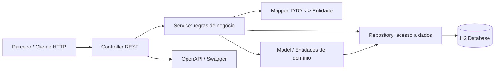

# Desafio Final: Arquitetura MVC

**Aluno:** Fabiano Dias Ramires  
**Projeto:** Repair Tips API  
**Tecnologia:** Java 25, Spring Boot, Spring Web, Spring Data JPA, H2 e OpenAPI 3.1

**Repositório GitHub:** [github.com/fdrtec/academy-repair-tips](https://github.com/fdrtec/academy-repair-tips)

## 1. Objetivo

Este trabalho implementa uma API REST para disponibilizar publicamente dados de peças e equipamentos compatíveis a parceiros de uma empresa de reparos. A solução aplica o padrão arquitetural MVC, separa responsabilidades em camadas e utiliza persistência de dados.

O domínio escolhido foi o de manutenção de equipamentos:

- **Part:** peça de reposição, identificada por nome e número;
- **Equipament:** equipamento, identificado por nome, marca, categoria e tipo;
- **Compatibilidade:** um equipamento pode utilizar várias peças, e uma peça pode ser compatível com vários equipamentos.

## 2. Requisitos atendidos

| Requisito do desafio | Implementação |
|---|---|
| Plataforma e linguagem | Java 25 com Spring Boot |
| API REST | Controllers REST em `/api/parts` e `/api/equipaments` |
| Create | `POST /api/parts` e `POST /api/equipaments` |
| Read por ID | `GET /api/{recurso}/{id}` |
| Update | `PUT /api/{recurso}/{id}` |
| Delete | `DELETE /api/{recurso}/{id}` |
| Find All | `GET /api/{recurso}` com paginação |
| Find By Name | `GET /api/{recurso}/search?name={nome}` |
| Contagem | `GET /api/{recurso}/count` |
| Arquitetura MVC | Controllers, entidades, services e repositories isolados |
| Persistência | Spring Data JPA com banco H2 |
| Documentação da API | Contrato versionado em [`docs/api/openapi.yaml`](docs/api/openapi.yaml) |
| Testes | Testes de integração com Spring Boot e MockMvc |

## 3. Arquitetura MVC

A aplicação utiliza MVC como estilo arquitetural e uma organização em camadas para manter cada responsabilidade isolada.



### Fluxo de uma requisição

1. O parceiro envia uma requisição HTTP para um controller.
2. O controller valida a entrada e delega a operação ao service.
3. O service aplica as regras de negócio e coordena mapeamento e persistência.
4. O repository consulta ou altera as entidades no banco H2.
5. O mapper converte entidades em DTOs antes da resposta HTTP.
6. O controller retorna o status HTTP e o payload documentados no contrato OpenAPI.

## 4. Estrutura de pastas

```text
src/main/java/br/com/fdrtec/repair_tips_api/
├── config/          Configurações da aplicação e OpenAPI
├── controller/      Endpoints REST e códigos de resposta HTTP
├── dto/             Modelos de entrada e saída da API
├── entity/          Entidades persistidas e modelo de domínio
├── exception/       Exceções e tratamento de erros Problem Details
├── mapper/          Conversão entre entidades e DTOs com MapStruct
├── repository/      Interfaces Spring Data JPA
├── service/         Regras de negócio e coordenação dos casos de uso
└── RepairTipsApiApplication.java

src/test/java/br/com/fdrtec/repair_tips_api/
├── PartControllerTest.java
├── EquipmentModelControllerTest.java
├── OpenApiDocumentationTest.java
└── RepairTipsApiApplicationTests.java
```

### Responsabilidade dos componentes

- **Controller:** recebe requisições HTTP, aplica validação de entrada, chama o service e define a resposta REST.
- **Service:** concentra regras de negócio, transações, resolução das peças compatíveis e tratamento de recurso inexistente.
- **Entity/Model:** representa o domínio e o estado persistido no banco.
- **Repository:** fornece a abstração de persistência com `JpaRepository`, incluindo consulta por nome e contagem.
- **DTO:** evita expor diretamente as entidades e define o contrato de entrada e saída.
- **Mapper:** converte DTOs e entidades sem misturar transporte com persistência.
- **Exception:** padroniza erros de validação, recursos inexistentes e falhas da API.
- **Config:** configura a documentação OpenAPI e demais componentes transversais.

## 5. Endpoints principais

### Parts

| Método | Endpoint | Finalidade |
|---|---|---|
| `POST` | `/api/parts` | Cria uma peça |
| `GET` | `/api/parts` | Lista peças com paginação |
| `GET` | `/api/parts/count` | Retorna a quantidade de peças ativas |
| `GET` | `/api/parts/search?name=Air%20filter` | Busca peças pelo nome exato |
| `GET` | `/api/parts/{id}` | Busca uma peça pelo ID |
| `PUT` | `/api/parts/{id}` | Atualiza uma peça |
| `DELETE` | `/api/parts/{id}` | Remove logicamente uma peça |

### Equipaments

| Método | Endpoint | Finalidade |
|---|---|---|
| `POST` | `/api/equipaments` | Cria um equipamento e associa peças |
| `GET` | `/api/equipaments` | Lista equipamentos com paginação |
| `GET` | `/api/equipaments/count` | Retorna a quantidade de equipamentos ativos |
| `GET` | `/api/equipaments/search?name=HP%20LaserJet%20Pro%20M404dn` | Busca equipamentos pelo nome exato |
| `GET` | `/api/equipaments/{id}` | Busca um equipamento pelo ID |
| `PUT` | `/api/equipaments/{id}` | Atualiza um equipamento e suas peças |
| `DELETE` | `/api/equipaments/{id}` | Remove logicamente um equipamento |

As rotas de busca e contagem são declaradas separadamente antes da rota dinâmica `/{id}`, evitando ambiguidades no roteamento.

## 6. Persistência e decisões técnicas

- O banco H2 é utilizado para execução local e testes automatizados.
- Spring Data JPA abstrai as operações de persistência.
- O relacionamento entre equipamentos e peças é `ManyToMany` por meio da tabela `equipament_part`.
- A exclusão utiliza soft delete: o registro permanece no banco e passa a ser considerado inativo.
- A paginação utiliza `Pageable`, reduzindo o volume de dados retornado em consultas de listagem.
- DTOs e MapStruct mantêm separados o modelo de transporte e o modelo persistido.
- O contrato OpenAPI é mantido como fonte versionada da API, enquanto as annotations dos controllers documentam a implementação executável.

## 7. Validação e evidências

Executar os testes com:

```bash
./mvnw test
```

Validar o contrato OpenAPI com:

```bash
npx --yes @stoplight/spectral-cli lint docs/api/openapi.yaml
```

A documentação interativa fica disponível, com a aplicação em execução, em:

- Swagger UI: `http://localhost:8080/swagger-ui/index.html`
- Documento OpenAPI gerado: `http://localhost:8080/v3/api-docs`
- Contrato versionado: [`docs/api/openapi.yaml`](docs/api/openapi.yaml)

Os testes automatizados comprovam o CRUD, paginação, validação, respostas de recurso inexistente, associação entre equipamentos e peças, contagem, busca por nome e exposição do contrato OpenAPI.

## 8. Conclusão

A solução atende ao desafio ao entregar uma API REST funcional, persistida e documentada, organizada em MVC com responsabilidades bem definidas. O desenho arquitetural e a estrutura de pastas tornam explícito o fluxo entre entrada HTTP, regras de negócio, modelo de domínio e banco de dados, permitindo evolução e manutenção por equipes distintas.
